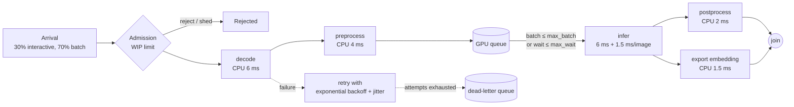
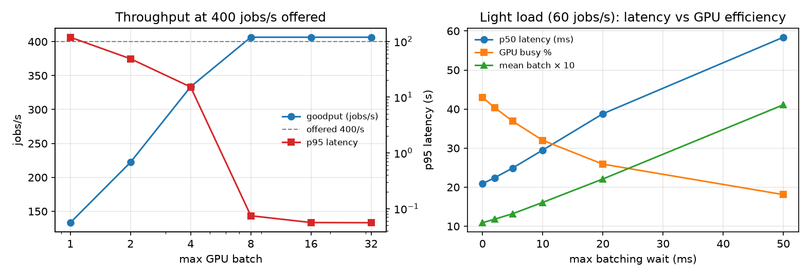
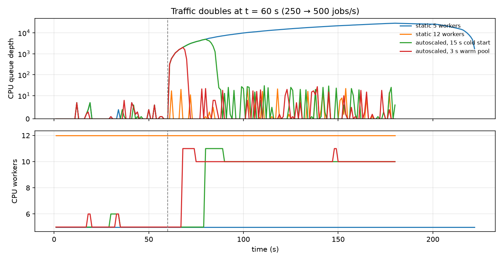

# Vision Pipeline Orchestrator

[](https://github.com/asher0913/vision-pipeline-orchestrator/actions/workflows/ci.yml)


[](LICENSE)

A discrete-event simulator for image-inference pipelines that run a DAG of CPU stages around a
batching GPU. It is built to answer the operational questions such a system raises: how large
should GPU batches be, what happens when traffic exceeds capacity, how many retries are worth
it, and what an autoscaler with cold starts really costs in tail latency.



- **Dependency-aware DAG** with validation (unknown dependencies, duplicates and cycles are
  rejected) and fan-out/join: a job completes when every branch has finished.
- **Resource pools.** A CPU worker pool served by a priority queue, so interactive tasks jump ahead
  of batch tasks at every stage; GPUs that form dynamic batches, dispatching when `max_batch`
  items are waiting or the oldest has waited `max_wait_ms`.
- **Backpressure by bounding work in progress**: `unbounded`, `reject` at a WIP limit, or
  `shed_batch`, which rejects batch jobs at 60% of the limit and interactive jobs only at 100%.
- **Retries** with exponential backoff and jitter; jobs that exhaust their attempts go to a
  dead-letter queue, and tasks of sibling branches are cancelled.
- **Autoscaling** of the CPU pool every 5 s from admitted throughput × CPU seconds per job plus
  the time to drain the backlog, with a configurable cold start before new workers serve.

Service times are lognormal around the means shown. They are illustrative figures for a
ResNet-class model, not measurements; the value of the simulator is in the shapes of the
trade-offs.

## Results

### GPU batching



At 400 jobs/s, a GPU that runs one image at a time saturates at **133 jobs/s** and its queue
grows without bound (p95 118 s). Allowing batches of 8 or more lifts capacity to the full
**407 jobs/s** with p95 of 56–74 ms. The mean batch at that load is only 6.5: dynamic
batching forms batches as large as the backlog, not as large as the cap. At light load the
`max_wait` knob trades latency for GPU efficiency: waiting up to 50 ms quadruples the mean batch
(1.1 → 4.1) and cuts GPU busy time from 43% to 18%, but nearly triples median latency
(21 → 58 ms).

### Overload and backpressure

900 jobs/s for one minute against a pipeline that sustains about 532 jobs/s:

| Admission | Goodput | Rejected (interactive) | Interactive p95 | Batch p95 | Peak WIP | Drain after traffic stops |
|---|---:|---:|---:|---:|---:|---:|
| unbounded | 532/s | 0 (0) | 76 ms | 50.7 s | 27,583 | 41.9 s |
| reject at WIP 400 | 533/s | 21,862 (6,605) | 72 ms | 1.09 s | 400 | 0.7 s |
| **shed batch first** | 532/s | 22,040 (**0**) | 74 ms | **0.96 s** | 260 | 0.4 s |

Admission control does not raise throughput, the bottleneck does not care; it bounds how much
work sits in queues. Without it, 27,000 jobs pile up (memory that a real service may not have)
and batch requests wait 50 s for answers their callers have long given up on. Rejecting at a WIP
limit keeps latency bounded but turns away 6,605 interactive requests that priority scheduling
would have served in under 100 ms; shedding batch work first rejects none of them.

### Retries and dead letters

2% of task executions fail transiently and 0.2% of inputs are corrupt (they fail every attempt
at decode). 300 jobs/s for one minute:

| Max attempts | Completed | Dead-lettered | Corrupt among them | Retries | p95 |
|---:|---:|---:|---:|---:|---:|
| 1 | 90.3% | 1,779 | 27 | 0 | 43.6 ms |
| 3 | **99.85%** | 28 | 27 | 1,928 | 60.4 ms |

With five tasks per job, a 2% per-task failure rate fails almost 10% of jobs outright. Three
attempts recover all but one of them, and what remains in the dead-letter queue is almost
exclusively the corrupt inputs, which is what a dead-letter queue is for. The cost is 17 ms of
p95 from backoff.

### Autoscaling through a traffic step



Traffic doubles from 250 to 500 jobs/s at t = 60 s:

| Setup | p50 | p95 | Interactive p95 | CPU worker-seconds |
|---|---:|---:|---:|---:|
| static, 5 workers | 16.6 s | 70.4 s (never recovers) | 47 ms | 1,113 |
| static, 12 workers | 51 ms | 102 ms | 69 ms | 2,161 |
| autoscaled, 15 s cold start | 463 ms | 8.7 s | 72 ms | **1,416 (−34%)** |
| autoscaled, 3 s warm pool | 57 ms | 3.0 s | 70 ms | 1,474 (−32%) |

The autoscaler saves a third of the worker time of static over-provisioning, and the price is
paid entirely during the ramp: 15 s of cold start plus a 5 s decision interval lets about 5,000
jobs queue before new capacity arrives. A warm pool that starts workers in 3 s cuts that backlog
by 60% and p95 by two thirds. Priority scheduling keeps interactive traffic at ~70 ms p95 in every
configuration, including the one that never catches up.

An earlier version scaled on CPU utilization and badly under-reacted: during overload, busy time
is capped by the workers that already exist, so utilization cannot express how far demand
exceeds capacity. Scaling on admitted throughput fixed that.

## Usage

```bash
pip install -e '.[dev]'

vpo run --rate 900 --cpu-workers 8 --admission shed_batch --wip-limit 400
vpo run --rate 300 --failure-rate 0.02 --poison-rate 0.002 --max-attempts 3
vpo run --rate 400 --max-batch 1
vpo report --out results          # every experiment, about 5 s
python scripts/make_figures.py    # needs matplotlib
```

## Tests

`pytest -q` runs 19 tests in about 2 seconds, including conservation (every offered job is
rejected, completed or dead-lettered), determinism per seed, the GPU batch cap, larger batches
when the wait budget grows, batching raising GPU capacity, the WIP bound, interactive traffic
surviving shedding, priority keeping interactive latency low under overload, retries leaving
only corrupt inputs in the dead-letter queue, joins waiting for the slowest branch, the
autoscaler adding workers after a step while using fewer worker-seconds, and DAG validation.

## Limitations

- One GPU pool and one CPU pool; no placement across machines, memory limits or network hops.
- Batches mix interactive and batch items and are executed as one; real servers may run
  separate queues per model or priority.
- Scale-down is immediate and ignores in-flight work beyond letting it finish; production
  autoscalers add cooldowns and hysteresis.
- Arrivals are Poisson; real traffic is burstier, which would make every tail in this report worse.

## License

MIT
