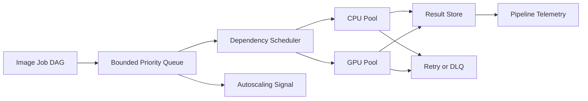

# Vision Pipeline Orchestrator

A backpressure-aware DAG scheduler for large-scale vision pipelines with priority queues, CPU/GPU placement, retries, dead-letter handling, autoscaling signals, and end-to-end telemetry.

This repository implements an original, laptop-scale reference system for a
production problem that repeatedly appears in strong AI/ML/software-engineering
portfolios. It focuses on architecture, failure handling, evaluation, and
reproducibility instead of claiming access to proprietary infrastructure.

## What is implemented

- Dependency-aware job DAG validation and execution
- Separate CPU/GPU capacity pools with deterministic placement
- Bounded priority queue and explicit backpressure rejection
- Retry budgets, exponential retry timestamps, and dead-letter queue
- Queue-depth autoscaling recommendation and throughput/error metrics

## Architecture



## Quick start

```bash
python -m venv .venv
source .venv/bin/activate
python -m pip install -e .
python -m unittest discover -s tests -v
PYTHONPATH=src python src/vision_pipeline_orchestrator/core.py
```

The demo prints a self-contained JSON report from seeded synthetic fixtures;
wall-clock latency values are machine-dependent. It is safe to run offline and
does not require credentials, paid APIs, GPUs, or employer data.

## Evaluation contract

The seeded simulator runs decode, preprocess, infer, and postprocess stages with injected transient and permanent failures. Reports include completion rate, retries, DLQ size, queue rejection, resource utilization, and makespan.

## Repository layout

- `src/vision_pipeline_orchestrator/core.py` - executable reference implementation
- `tests/test_core.py` - deterministic regression and failure-path tests
- `benchmark-report.json` - checked-in output from the deterministic demo
- `.github/workflows/ci.yml` - clean-install CI on Python 3.12

## Scope and provenance

The problem definition was inspired by recurring engineering patterns observed
while reviewing a large resume corpus. All naming, source code, fixtures, and
documentation in this repository are original. Reported demo numbers are local
synthetic measurements, not production claims. The system is intentionally
compact so reviewers can inspect every design decision.

## License

MIT
